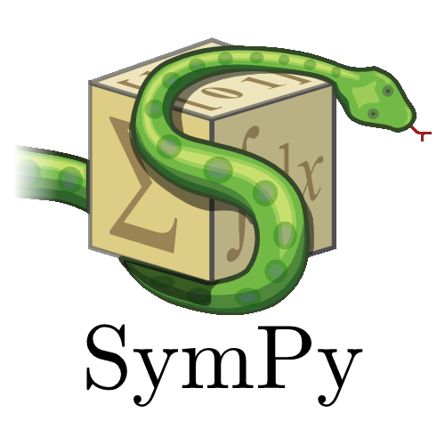

# SymPy for Chez Scheme

## Depencies:

- [Darkart](https://github.com/guenchi/Darkart)

- [CPython](https://github.com/python/cpython)

- [SymPy](https://github.com/sympy/sympy)

## Darkart's ecosystem

- [NumPy](https://github.com/guenchi/NumPy)

- [SciPy](https://github.com/guenchi/SciPy)

- [SymPy](https://github.com/guenchi/SymPy)

- [Matplotlib](https://github.com/guenchi/Matplotlib)

- [Pandas](https://github.com/guenchi/Pandas)
